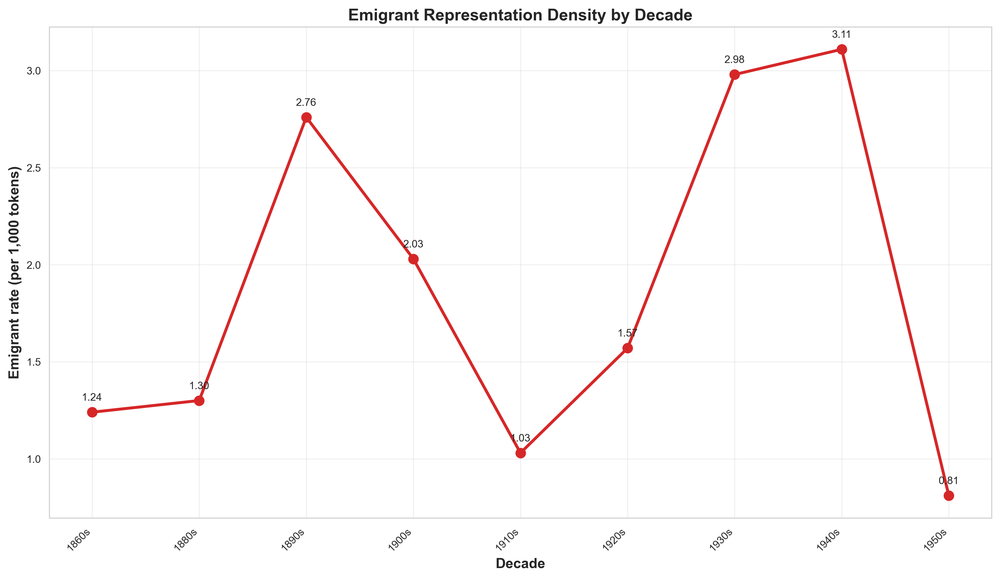

# Freeze-Lite Bundle - Documentation

## Overview

The **freeze-lite** is a versioned, paper-ready snapshot of core computational artifacts (figures, tables, reports) designed for reproducibility and archival. Unlike a full freeze (which includes all intermediate outputs and raw data), freeze-lite contains only curated, publication-grade artifacts optimized for size and portability.

**Purpose:**
- **Reproducibility**: Timestamped bundle with Git commit hash for exact provenance tracking
- **Paper integration**: Direct citation of figures/tables with stable paths
- **Archival**: Lightweight package for long-term storage (GitHub releases, Zenodo deposits)
- **Validation**: Manifest with checksums (SHA256) for integrity verification

## Current Version: v1.0.2-lite

**Release date:** 2026-02-27  
**Git commit:** `8947a9bdd29c3e958b3236725d832d4d1959329f`  
**Total artifacts:** 94 files  
**Bundle size:** ~15 MB (estimated)

### Key Enhancements (v1.0.2)
- **Bilingual figures**: All 14 evidence-pack figures in ES/EN (56 files: _{es,en}.{png,pdf})
- **Metadata 100% coverage**: 0 unknown_genre, 0 unknown_year, 0 unknown_decade (via external corpus enrichment)
- **Token normalization**: v2tokens (fulltext TEI) as canonical denominators
- **QA validation**: Passed bilingual figures + metadata quality checks

See [CHANGELOG.md](../CHANGELOG.md) for full release notes.

## Bundle Structure

```
05_freeze/v1.0.2-lite/
├── FREEZE_NOTES.md           # Freeze metadata (timestamp, commit, commands)
├── figures/
│   └── static/               # 84 figure files (56 bilingual + 28 duplicated heatmaps)
│       ├── fig_emigrant_by_author_top15_es.{png,pdf}
│       ├── fig_emigrant_by_author_top15_en.{png,pdf}
│       ├── fig_emigrant_by_decade_es.{png,pdf}
│       ├── fig_emigrant_by_decade_en.{png,pdf}
│       ├── fig_emigrant_by_format_es.{png,pdf}
│       ├── fig_emigrant_by_format_en.{png,pdf}
│       ├── fig_emigrant_markers_top20_es.{png,pdf}
│       ├── fig_emigrant_markers_top20_en.{png,pdf}
│       ├── fig_emigrant_markers_profile_by_author_es.{png,pdf}
│       ├── fig_emigrant_markers_profile_by_author_en.{png,pdf}
│       ├── fig_emigrant_markers_profile_by_genre_es.{png,pdf}
│       ├── fig_emigrant_markers_profile_by_genre_en.{png,pdf}
│       ├── fig_emigrant_mediation_density_es.{png,pdf}
│       ├── fig_emigrant_mediation_density_en.{png,pdf}
│       ├── fig_emigrant_profile_by_author_es.{png,pdf}
│       ├── fig_emigrant_profile_by_author_en.{png,pdf}
│       ├── fig_emigrant_profile_by_decade_es.{png,pdf}
│       ├── fig_emigrant_profile_by_decade_en.{png,pdf}
│       ├── fig_emigrant_temporal_by_genre_es.{png,pdf}
│       ├── fig_emigrant_temporal_by_genre_en.{png,pdf}
│       ├── fig_production_timeline_es.{png,pdf}
│       ├── fig_production_timeline_en.{png,pdf}
│       ├── fig_emigrant_heatmap_decade_author_es.{png,pdf}
│       ├── fig_emigrant_heatmap_decade_author_en.{png,pdf}
│       ├── fig_emigrant_heatmap_decade_author_top12_es.{png,pdf}
│       ├── fig_emigrant_heatmap_decade_author_top12_en.{png,pdf}
│       ├── fig_emigrant_heatmap_decade_author_full_es.{png,pdf}
│       └── fig_emigrant_heatmap_decade_author_full_en.{png,pdf}
├── tables/                   # 5 summary CSV tables
│   ├── corpus_master_table_v2tokens.csv
│   ├── emigrant_by_author_v2tokens.csv
│   ├── emigrant_by_decade_v2tokens.csv
│   ├── emigrant_by_format_v2tokens.csv
│   └── work_tokens_full.csv
├── reports/                  # 1 narrative report
│   └── EVIDENCE_PACK_EMIGRANTE.md
└── manifests/                # 3 integrity/traceability files
    ├── ARTIFACTS_MANIFEST.md         # Human-readable artifact list with sources
    ├── ARTIFACTS_MANIFEST.csv        # Machine-readable artifact list
    └── MANIFEST_SHA256.txt           # SHA256 checksums for all artifacts
```

## Artifact Inventory

### Figures (84 files)

#### Core Evidence Figures (56 bilingual files = 14 basenames × 4 variants)

| Basename | Description | Source Script | Formats |
|----------|-------------|---------------|---------|
| `fig_emigrant_by_author_top15` | Top 15 authors by emigrant mentions/1k tokens | `generate_evidence_figures.py` | _{es,en}.{png,pdf} |
| `fig_emigrant_by_decade` | Emigrant mentions by decade | `generate_evidence_figures.py` | _{es,en}.{png,pdf} |
| `fig_emigrant_by_format` | Emigrant mentions by literary format | `generate_evidence_figures.py` | _{es,en}.{png,pdf} |
| `fig_emigrant_markers_top20` | Top 20 emigrant markers (keywords) | `generate_evidence_figures.py` | _{es,en}.{png,pdf} |
| `fig_emigrant_markers_profile_by_author` | Marker profiles by author (stacked) | `emigrant_profile_analysis.py` | _{es,en}.{png,pdf} |
| `fig_emigrant_markers_profile_by_genre` | Marker profiles by genre (stacked) | `emigrant_profile_analysis.py` | _{es,en}.{png,pdf} |
| `fig_emigrant_mediation_density` | Mediation density by top authors | `emigrant_profile_analysis.py` | _{es,en}.{png,pdf} |
| `fig_emigrant_profile_by_author` | Semantic family distribution by author | `emigrant_profile_composition_analysis.py` | _{es,en}.{png,pdf} |
| `fig_emigrant_profile_by_decade` | Semantic family distribution by decade | `emigrant_profile_composition_analysis.py` | _{es,en}.{png,pdf} |
| `fig_emigrant_temporal_by_genre` | Temporal evolution by genre | `temporal_composition_analysis.py` | _{es,en}.{png,pdf} |
| `fig_production_timeline` | Corpus production timeline | `generate_evidence_figures.py` | _{es,en}.{png,pdf} |
| `fig_emigrant_heatmap_decade_author` | Heatmap all authors × decades | `emigrant_heatmap_author_decade_expanded.py` | _{es,en}.{png,pdf} |
| `fig_emigrant_heatmap_decade_author_top12` | Heatmap top 12 authors × decades | `emigrant_heatmap_author_decade_expanded.py` | _{es,en}.{png,pdf} |
| `fig_emigrant_heatmap_decade_author_full` | Heatmap full corpus (all authors) | `emigrant_heatmap_author_decade_expanded.py` | _{es,en}.{png,pdf} |

**Translation approach:**
- Core figures (11 basenames): Full i18n with translated axis labels, titles, genre labels via `i18n_figures.py`
- Heatmaps (3 basenames): Pragmatic duplication (minimal translatable text; author names and decades don't translate)

#### Supplementary Figures (28 duplicated heatmaps)
- Legacy heatmaps without language suffix (duplicated for compatibility)
- **Note:** These will be deprecated in v1.1.0; use bilingual versions instead

### Tables (5 CSV files)

| Filename | Description | Source Script | Rows | Columns |
|----------|-------------|---------------|------|---------|
| `corpus_master_table_v2tokens.csv` | Master corpus metadata with v2tokens | `rebuild_master_with_full_tokens.py` | 80 | ~20 |
| `emigrant_by_author_v2tokens.csv` | Emigrant mentions aggregated by author | `generate_emigrant_evidence_tables.py` | ~9 | ~8 |
| `emigrant_by_decade_v2tokens.csv` | Emigrant mentions aggregated by decade | `generate_emigrant_evidence_tables.py` | ~9 | ~7 |
| `emigrant_by_format_v2tokens.csv` | Emigrant mentions aggregated by format | `generate_emigrant_evidence_tables.py` | ~4 | ~7 |
| `work_tokens_full.csv` | Canonical token counts per work (fulltext TEI) | `count_word_tokens_from_tei.py` | 80 | ~3 |

**Naming convention:** `*_v2tokens` suffix indicates canonical token denominator (TEI fulltext) used for rate calculations.

### Reports (1 Markdown file)

| Filename | Description | Source Script | Lines |
|----------|-------------|---------------|-------|
| `EVIDENCE_PACK_EMIGRANTE.md` | Narrative synthesis of emigrant module findings | `generate_emigrant_evidence_report.py` | ~200 |

### Manifests (3 integrity files)

| Filename | Description | Purpose |
|----------|-------------|---------|
| `ARTIFACTS_MANIFEST.md` | Human-readable artifact list with source scripts | Documentation |
| `ARTIFACTS_MANIFEST.csv` | Machine-readable artifact list (path, source, timestamp) | Automation |
| `MANIFEST_SHA256.txt` | SHA256 checksums for all artifacts | Integrity verification |

## Generation Workflow

### Commands
```bash
# Step 1: Generate all evidence-pack artifacts
make evidence-pack-emigrante-v2tokens

# Step 2: Validate artifacts (QA checks)
make qa-final

# Step 3: Freeze artifacts with timestamp and Git commit
make freeze-lite
```

### Pipeline Steps (evidence-pack-emigrante-v2tokens)
1. **Token normalization**: Extract fulltext token counts from TEI (`count_word_tokens_from_tei.py`)
2. **Master table rebuild**: Merge fulltext tokens into corpus master table (`rebuild_master_with_full_tokens.py`)
3. **Evidence tables**: Generate emigrant summary tables by author/decade/format (`generate_emigrant_evidence_tables.py`)
4. **Core figures**: Generate 4 core bilingual figures (`generate_evidence_figures.py --lang both`)
5. **Profile figures**: Generate 3 profile analysis bilingual figures (`emigrant_profile_analysis.py --lang both`)
6. **Composition figures**: Generate 2 composition analysis bilingual figures (`emigrant_profile_composition_analysis.py --lang both`)
7. **Temporal figures**: Generate 1 temporal evolution figure (`temporal_composition_analysis.py`)
8. **Heatmaps**: Generate 3 heatmap variants (`emigrant_heatmap_author_decade_expanded.py`)
9. **Duplicate heatmaps**: Copy heatmaps with `_es`/`_en` suffixes (`duplicate_heatmaps_bilingual.py`)
10. **Clean legacy**: Remove figures without language suffix (`clean_legacy_figures.py`)
11. **Pack v2**: Update emigrant representation pack (`update_emigrant_pack_v2.py`)
12. **Report**: Generate narrative evidence report (`generate_emigrant_evidence_report.py`)

### QA Validation (qa-final)
Validates 3 criteria (exit code 0 = pass, 1 = fail):
1. **Bilingual figures**: 56 files exist (14 basenames × 4 variants: _{es,en}.{png,pdf})
2. **Metadata quality**: 0 unknown_genre, 0 unknown_year, 0 unknown_decade in corpus_master_table_v2tokens.csv
3. **Heatmap integrity**: Legacy heatmap aliases exist for compatibility

## Integrity Verification

### SHA256 Checksums
```bash
# Verify integrity of freeze-lite artifacts
cd 05_freeze/v1.0.2-lite
sha256sum -c manifests/MANIFEST_SHA256.txt
```

Expected output:
```
figures/static/fig_emigrant_by_author_top15_es.png: OK
figures/static/fig_emigrant_by_author_top15_es.pdf: OK
...
tables/corpus_master_table_v2tokens.csv: OK
reports/EVIDENCE_PACK_EMIGRANTE.md: OK
```

### Manifest Contents
See `manifests/ARTIFACTS_MANIFEST.md` for:
- Full file list (94 artifacts)
- Source script for each artifact
- Generation timestamp
- File size estimates

## Usage in Paper

### Citing Figures
When citing figures in the paper manuscript, use stable freeze-lite paths:

```markdown

```

or with LaTeX:
```latex
\includegraphics{../05_freeze/v1.0.2-lite/figures/static/fig_emigrant_by_decade_en.pdf}
```

**Naming convention for citations:**
- Use `_en` suffix for English-language papers
- Use `_es` suffix for Spanish-language papers
- Use `.pdf` for vector graphics (recommended for LaTeX)
- Use `.png` for raster graphics (web/Word documents)

### Citing Tables
Reference tables with stable paths:

```python
import pandas as pd
df = pd.read_csv('../05_freeze/v1.0.2-lite/tables/emigrant_by_author_v2tokens.csv')
```

### Data Availability Statement (Template)

> The computational artifacts supporting this study (figures, tables, reports) are available in the project repository under `05_freeze/v1.0.2-lite/` (Git commit: `8947a9b`). The full pipeline is reproducible via `make evidence-pack-emigrante-v2tokens && make freeze-lite`. The freeze-lite bundle will be archived on Zenodo upon publication.
>
> **DOI:** [PENDING - Zenodo deposit after paper acceptance]

## Differences from Full Freeze

| Feature | Full Freeze (`make freeze`) | Freeze-Lite (`make freeze-lite`) |
|---------|----------------------------|-----------------------------------|
| **Figures** | All figures (100+ files) including exploratory/draft versions | Only paper-ready evidence-pack figures (84 files) |
| **Tables** | All intermediate tables (30+ files) | Only summary tables (5 files) |
| **Reports** | All QA reports + evidence report | Only evidence report (1 file) |
| **Reading packs** | All packs (diverse, balanced, emigrant) with case cards | Not included (available in `03_analysis/`) |
| **Networks** | Co-occurrence networks (GraphML) | Not included |
| **Size** | ~50 MB | ~15 MB |
| **Git tracked** | No (too large; .gitignored) | Yes (lightweight; committed to repo) |
| **Purpose** | Archival snapshot of ALL outputs | Paper-ready curated artifacts |

## Version History

| Version | Date | Git Commit | Key Changes |
|---------|------|------------|-------------|
| **v1.0.2-lite** | 2026-02-27 | `8947a9b` | Bilingual figures (ES/EN), metadata 100% coverage, v2tokens normalization |
| **v1.0.1-lite** | 2026-02-26 | (unknown) | Partial bilingual support (7 figures) |
| **v1.0.0** | 2026-02-25 | (unknown) | Baseline evidence pack (monolingual) |

## Future Plans

### v1.1.0 (Planned)
- [ ] Remove duplicate heatmaps (deprecate legacy versions without `_es`/`_en` suffix)
- [ ] Add token_mismatch_audit.csv to tables/ (QA diagnostic)
- [ ] Add emigrant_representation_pack_v2.csv to bundle (reading pack)
- [ ] Generate ARTIFACTS_MANIFEST.json (machine-readable JSON)
- [ ] Add freeze-lite.zip target for single-file distribution

### Post-Publication
- [ ] Upload freeze-lite to Zenodo with DOI
- [ ] Tag GitHub release (v1.0.2) with freeze-lite attached
- [ ] Update README.md with DOI badge

## Troubleshooting

### Missing Artifacts
```bash
# Regenerate freeze-lite from scratch
make clean-freeze
make evidence-pack-emigrante-v2tokens
make qa-final
make freeze-lite
```

### Checksum Mismatch
If SHA256 verification fails:
1. Check for manual edits to artifacts (NOT recommended)
2. Regenerate manifest: `make freeze-lite` (overwrites MANIFEST_SHA256.txt)
3. Git diff to see what changed

### Outdated Freeze
If working directory has newer artifacts than freeze:
```bash
# Update freeze-lite
make freeze-lite  # Overwrites 05_freeze/vX.Y.Z-lite/
git add 05_freeze/
git commit -m "chore: update freeze-lite v1.0.2"
```

## Contact

For questions about the freeze-lite bundle or reproducibility:
- **Repository:** [GitHub link - placeholder]
- **Documentation:** See [README_PROJECT.md](README_PROJECT.md) and [METHODOLOGY.md](METHODOLOGY.md)
- **Issues:** Open a GitHub issue with tag `freeze-lite`

---

**Document version:** 1.0.0  
**Last updated:** 2026-02-28  
**Maintainer:** Etnografía Gallega Team
